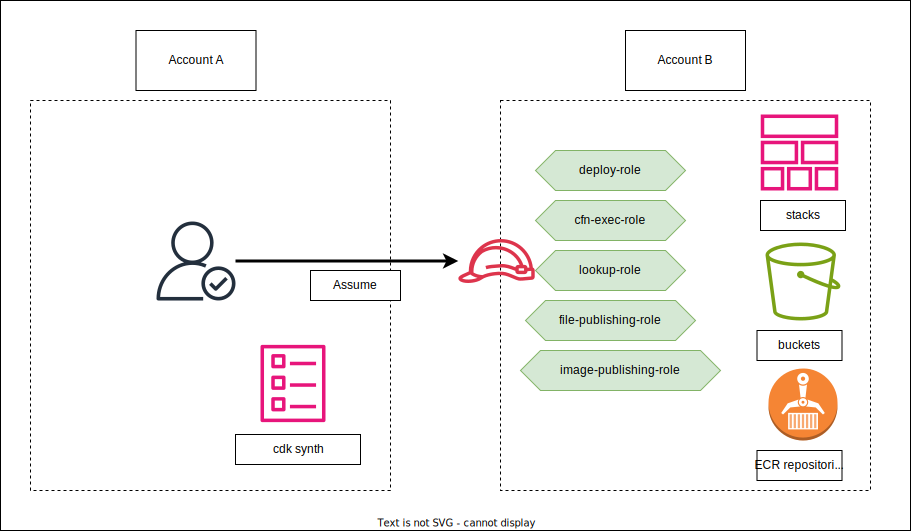

# CDK Cross Account Deployments

In this episode, we'll walk through some common scenarios for AWS CDK cross account deployments.

## Overview

We will deploy from Account A to Account B. They could in the same or different AWS regions.



Let's assume the account IDs are:

```
Account A: 111111111111
Account B: 222222222222
```

## Bootstrap

Generally, we need to bootstrap both accounts. Let's say your default region is `us-east-1`.

For Account A:

```sh
# run as the admin of Account A
$ cdk bootstrap aws://111111111111/us-east-1
```

For Account B:

```sh
# run as the admin of Account B
$ cdk  bootstrap aws://222222222222/us-east-1 --trust 111111111111 --trust-for-lookup 111111111111 --cloudformation-execution-policies arn:aws:iam::aws:policy/AdministratorAccess

# [optional] bootstrap us-west-2 as well
$ cdk  bootstrap aws://222222222222/us-west-2 --trust 111111111111 --trust-for-lookup 111111111111 --cloudformation-execution-policies arn:aws:iam::aws:policy/AdministratorAccess
```

If you check the CFN console for the `CDKToolKit` stack from Account B, you will see 5 IAM roles provisioned in the format of `cdk-hnb659fds-<ROLE_NAME>-222222222222-us-east-1`. If you check the trust policies of the `deploy-role`, it looks like:

```json
{
    "Version": "2008-10-17",
    "Statement": [
        {
            "Effect": "Allow",
            "Principal": {
                "AWS": "arn:aws:iam::222222222222:root"
            },
            "Action": "sts:AssumeRole"
        },
        {
            "Effect": "Allow",
            "Principal": {
                "AWS": "arn:aws:iam::111111111111:root"
            },
            "Action": "sts:AssumeRole"
        }
    ]
}
```

Which means this role could be assumed by both account if they have relevant `sts:AssumeRoile` iam policies.

Next, let's dive into the scenarios.

## Scenario 1 - manual deployment (cross account, same or different region)

```ts
import { App, Stack, StackProps, 
  aws_sqs as sqs } from 'aws-cdk-lib';
import { Construct } from 'constructs';

export class MyStack extends Stack {
  constructor(scope: Construct, id: string, props: StackProps = {}) {
    super(scope, id, props);

		// let's just create a SQS Queue
		new sqs.Queue(this, 'DummyQueue');
  }
}

// for production, use account/region from cdk cli
const accountB = {
  account: '222222222222',
  region: process.env.CDK_DEFAULT_REGION,
};

const app = new App();

new MyStack(app, 'cdk-cross-account-dev', { env: accountB });

app.synth();
```

```sh
$ cdk deploy
```

That's it! What's happening under the hood is your current identity from Account A is assuming different IAM roles on Account B for assets uplading, context lookup and cloudformation executions. Make sure your current IAM identity has permissions to `sts:AssumeRole` on the IAM roles from account B.


## Scenario 2 - CDK pipelines (cross account, same region)

Let's deploy a cdk pipeline in Account B which deploys a stack to Account B.

You need to enable `crossAccountKeys: true` for the pipelines. See [doc](https://github.com/aws/aws-cdk/tree/main/packages/aws-cdk-lib/pipelines#deploying-to-other-accounts--encrypting-the-artifact-bucket) for more details.

Check out the [sample code](./src/pipeline.ts)


```sh
# cdk diff 
$ npx cdk -a 'npx ts-node src/pipeline.ts' diff PipelineStack
# cdk deploy
$ npx cdk -a 'npx ts-node src/pipeline.ts' deploy PipelineStack
```

Go to AWS CodePipeline console to check the status.

## Scenario 3 - CDK pipelines (cross account, cross region)

Just update the region for `accountB` in [pipeline.ts](./src/pipeline.ts)

```ts
const accountB = {
  account: '222222222222',
  region: 'us-west-2'
};
```

Git commit and push to your source repo, triggering the pipeline update and re-deployment.


## Scenario 4 - CodeBuild for cross account/region deployments

Checkout the [codebuild.ts](./src/codebuild.ts) and [buildspec.yaml](./src/buildspec.yaml)

